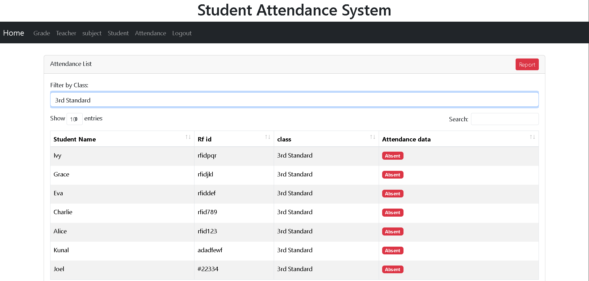
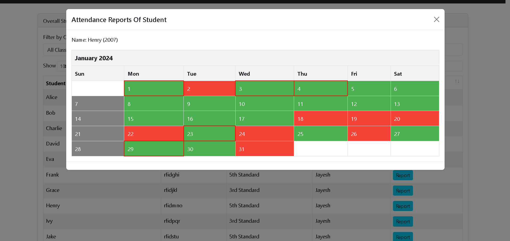
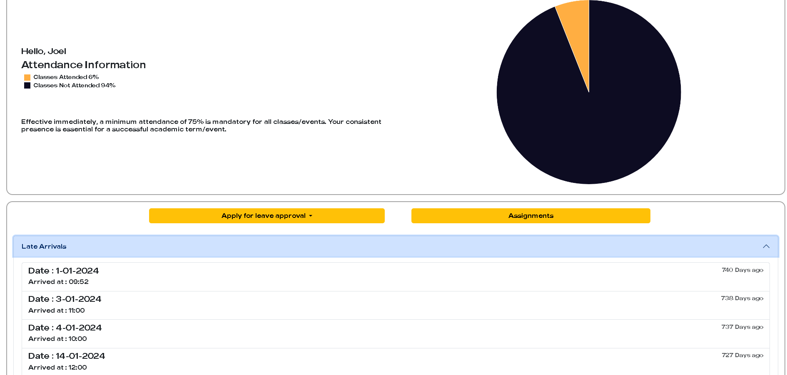
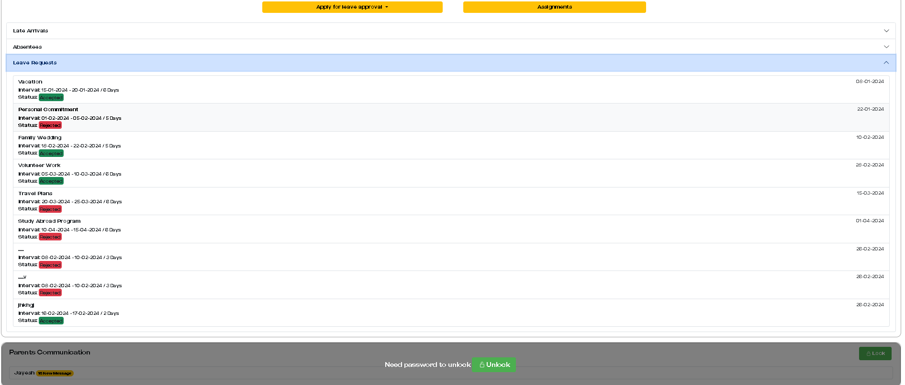
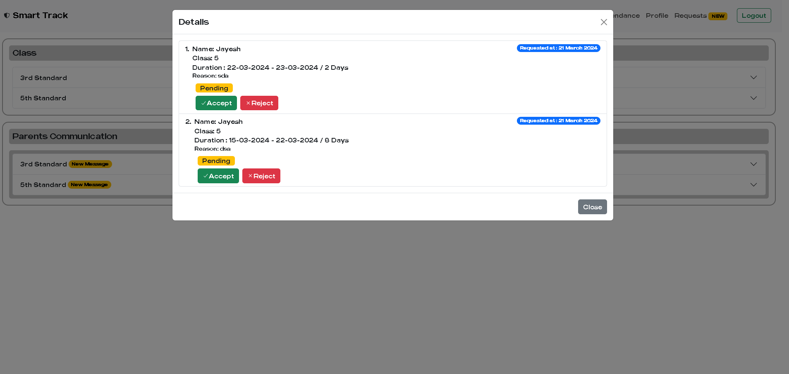
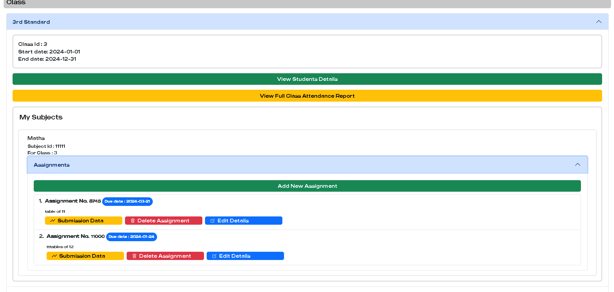
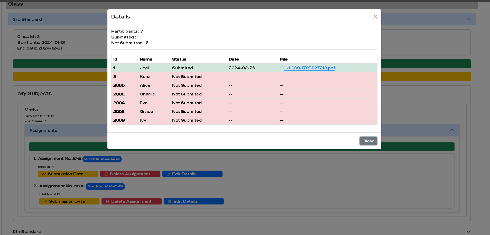
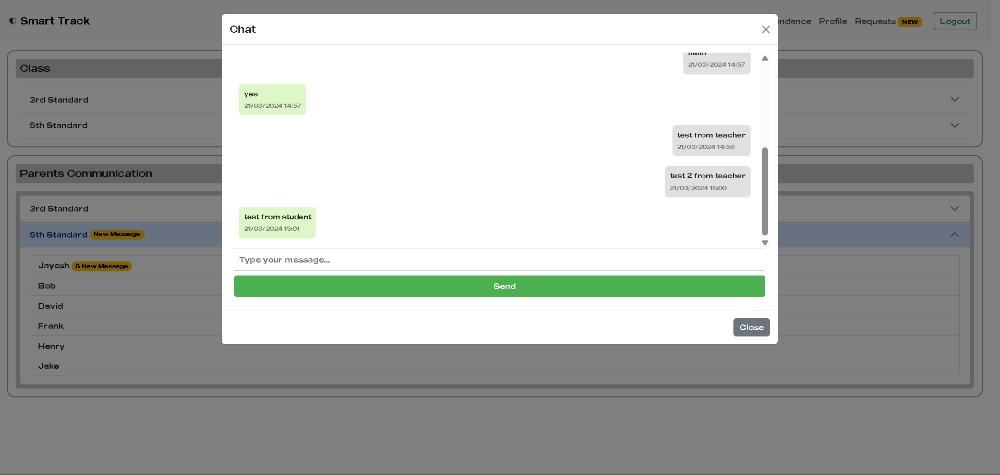

<div align="center">
  <h1>🎓 RFID Attendance Tracker System</h1>
  <p>A comprehensive system to automate school attendance using RFID technology, complete with student, teacher, parent, and admin portals.</p>
</div>

## 📖 Overview
The **RFID Attendance Tracker** automates the traditional process of tracking student attendance. Using an RFID card, students can securely record their presence. The system also bridges the communication gap between parents and teachers and provides extensive tools for academic management.

## ✨ Features
### 🧑‍🎓 Student Portal
- View daily attendance records.
- Submit assignments online.
- Request leaves directly through the system.
- View remarks and feedback from teachers.

### 👩‍🏫 Teacher Portal
- Mark and monitor student attendance.
- Approve or decline leave requests.
- Post class assignments and evaluate submissions.
- Direct chat with parents regarding student progress.

### 👨‍👩‍👦 Parent Portal (via Student Account)
- Password-protected access exclusive to parents.
- Chat with teachers seamlessly.
- Monitor child's attendance and academic progress.

### 🛡️ Admin Panel
- Comprehensive management of:
  - Subjects & Classes
  - Teachers & Students
  - Overall Attendance Records

## 🛠️ Technology Stack
- **Frontend**: HTML5, CSS3, Vanilla JS
- **Backend Core**: PHP
- **Real-time Engine**: Node.js (Express, Socket.IO) for chat and live attendance updates.
- **Database**: MySQL (`attendance_tracker`)

## 📸 Screenshots
*(Below are some views from the application)*

### Dashboard / Interface
















## 🚀 Getting Started

### Prerequisites
- PHP Environment (e.g., XAMPP/WAMP/LAMP)
- Node.js installed
- MySQL Server

### Installation
1. Clone or download this repository to your local web server's root directory (e.g., `htdocs` for XAMPP).
2. **Database Setup:**
   - Open phpMyAdmin or your MySQL client.
   - Create a database named `attendance_tracker`.
   - Import the provided `attendance_tracker (10).sql` file into this database.
3. **Database Configuration:**
   - Update `database_connection.php` with your local MySQL credentials if they differ from the default.
4. **Node.js Setup (Real-time features):**
   - Open a terminal in the project directory.
   - Install dependencies:
     ```bash
     npm install
     ```
   - Start the Node.js server (this handles real-time updates and websockets):
     ```bash
     node attendenceExpress.js
     ```
5. **Run the Application:**
   - Open your web browser and navigate to the project folder on your local server (e.g., `http://localhost/RFID_ATTENDANCE_TRACKER/index.php`).

## 🔒 Security & Access
- **Role-Based Access**: Specialized portals for Admins, Teachers, and Students.
- **Parental Controls**: The parent chat feature is nested inside the student account but requires an independent password, ensuring privacy between the parent and teacher.
